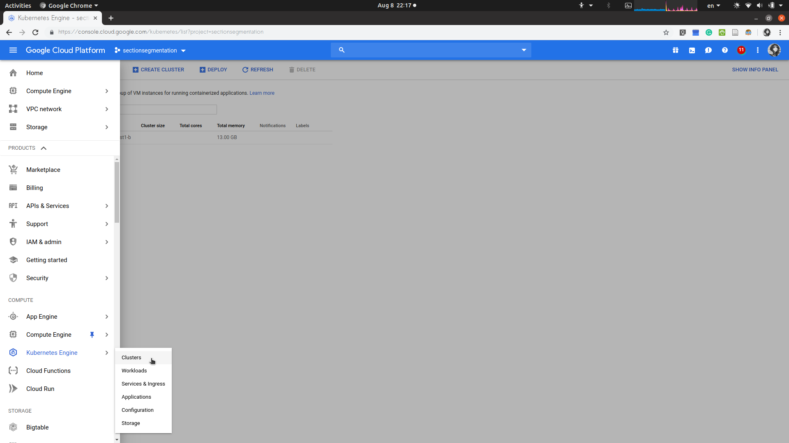
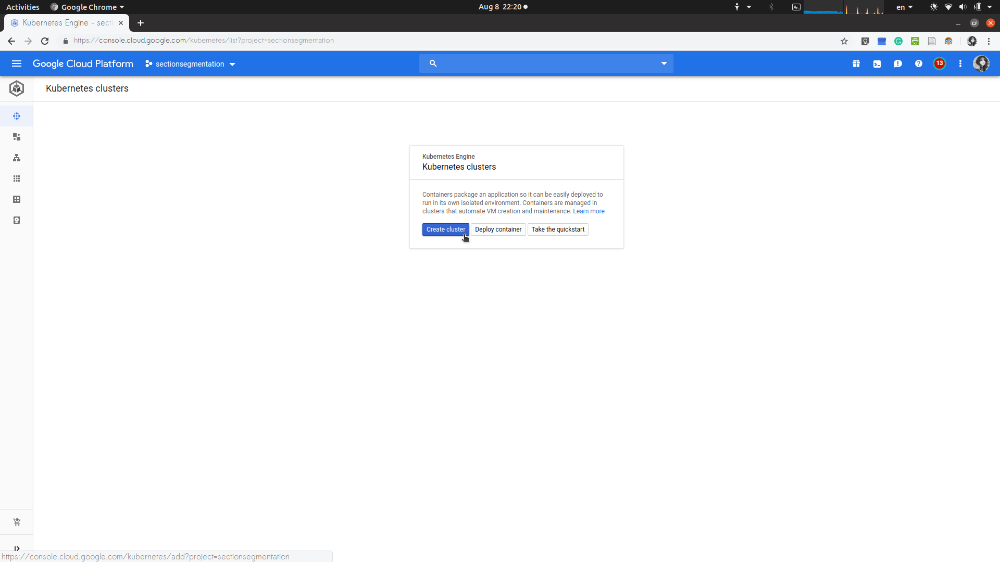
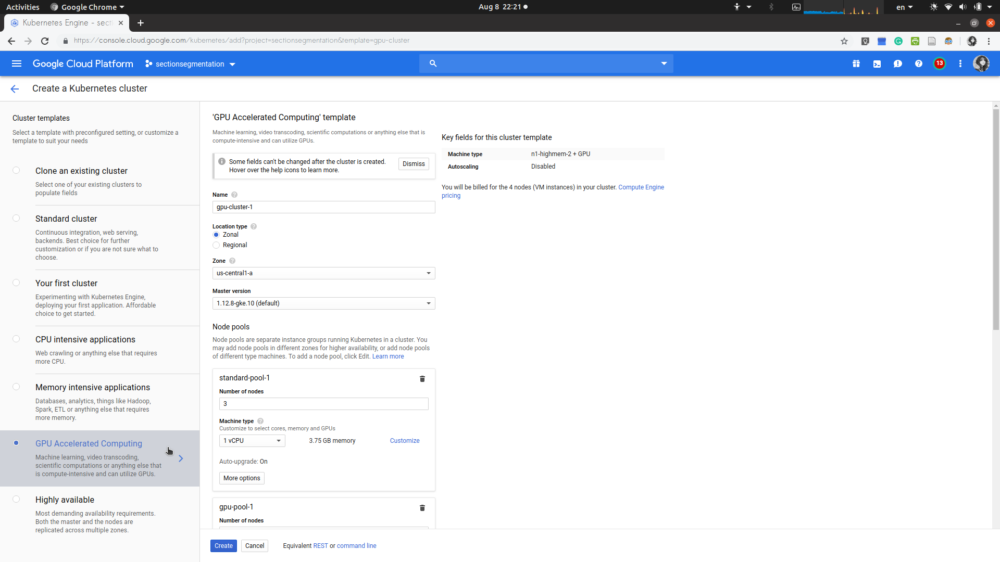
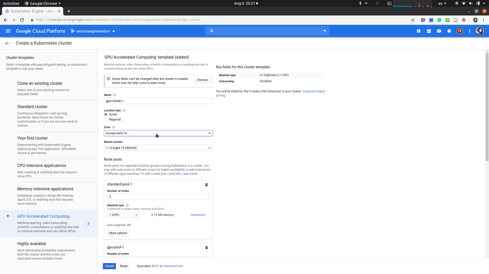
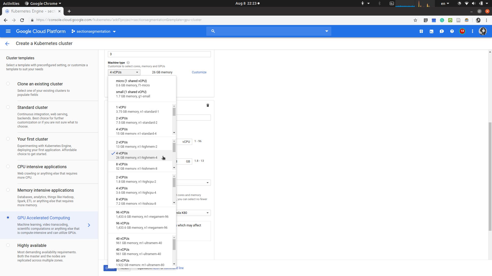
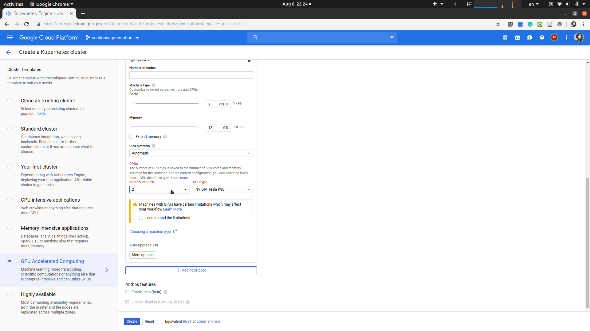
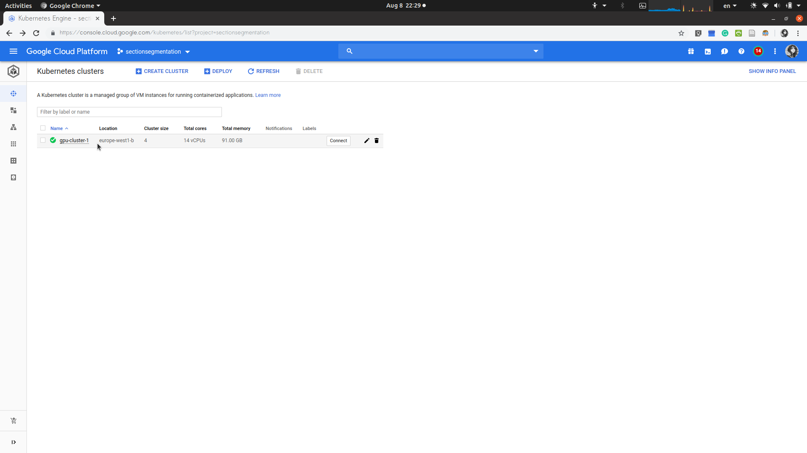
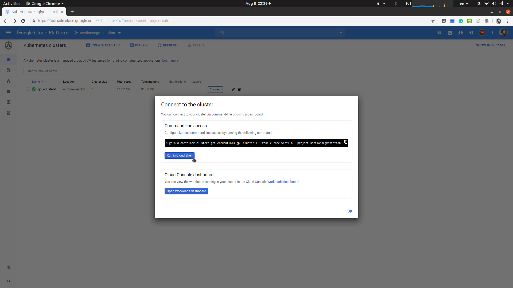
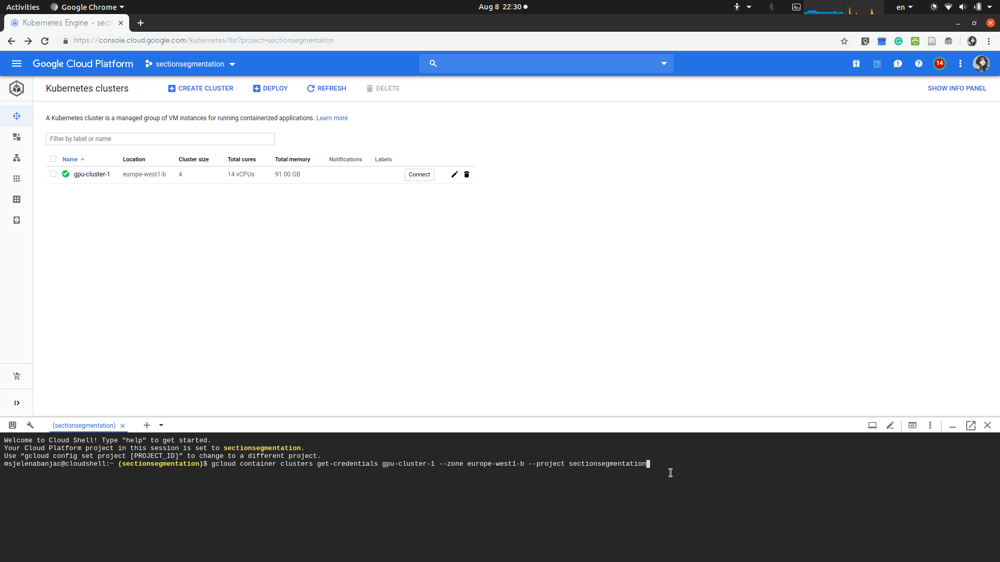

# Steps for Setting-up kubernetes

1. Go to Kubernetes Engine > Clusters


2. Click on Create cluster

    1) Choose cluster template: GPU Accelerated Computing
    
    2) Choose Zone: europe-west1-b
    
    3) In node pools, for standard-pool-1 node, the machine type is: 4 vCPUs (26 GB memory, n1-highmem-4)
    
    4) In node pools, for gpu-pool-1 node, the Number of GPUs is: 2, GPU type: NVIDIA Tesla K80.
    
    5) Check the warning checkbox regarding the limitations of using nodes with GPUs.
    
    6) When finished with creating the kubernetees nodes, you will be able to see the following: 
    

3. Run the cluster by pressing the Connect and then Run the Cloud Shell.


4. Cluster is started, and you should be able to see the following:


5. For the kubernetes commands, please follow following commands:

```
# Initial kubernetees command
gcloud container clusters get-credentials gpu-cluster-1 --zone europe-west1-b --project sectionsegmentation

# Should enable GPU support in Kubernetes: https://github.com/NVIDIA/k8s-device-plugin
# Install NVIDIA drivers on Container-Optimized OS: https://kubernetes.io/docs/tasks/manage-gpus/scheduling-gpus/
kubectl create -f https://raw.githubusercontent.com/GoogleCloudPlatform/container-engine-accelerators/stable/daemonset.yaml
# and this one:
kubectl create -f https://raw.githubusercontent.com/NVIDIA/k8s-device-plugin/1.0.0-beta/nvidia-device-plugin.yml

# if exists: 
kubectl delete deployments,svc sectionsegmentation
# create new (it is in the sectionsegmentationml repo)
kubectl create -f sectionsegmentation-k8s.yaml

# stats
kubectl get pods
kubectl get svc

# decribe if pending:
kubectl describe pod sectionsegmentation-5dc96f7f5d-nfldl

# see inside the pod:
kubectl exec -it sectionsegmentation-dfb6f4c97-bssk4 -- /bin/bash

```